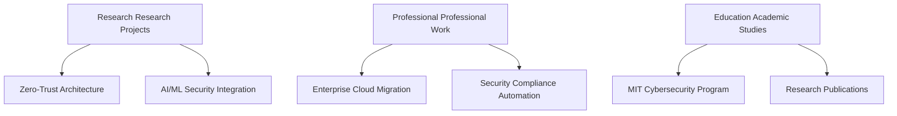

# Star Hi there! I'm **Ariff Mohamed** 

  
  
  
  
  
  

---

## Target **About Me**

> Research **Research-Driven Cloud Solutions Engineer** | Education **MIT Student (Cybersecurity Focus)** | Cloud **Azure Security Engineer Associate**

I'm pursuing my **Master of Information Technology** with specialization in **Cybersecurity** (2026) at Whitecliffe College, where I bridge academic research with enterprise practice to deliver cutting-edge security solutions.

### Featured **What I Bring to the Table:**

- Security **Evidence-Based Security** – Applying research methodologies to cybersecurity implementations
- Shield **Advanced Threat Intelligence** – Academic-backed approach to Azure Sentinel and Defender deployments  
- AI **Intelligent Security Systems** – Integrating AI/ML research with Microsoft security stack
- Analytics **Strategic Technology Management** – Academic governance frameworks applied to enterprise environments

### Research **Current Research Focus:**

*Zero-trust architecture optimization in hybrid Microsoft cloud environments*

 

---

## Tools **Tech Stack & Expertise**

### Cloud **Cloud & Infrastructure**

### Encryption **Security & Compliance**

### Configuration **Development & DevOps**

---

## Achievement **Certifications & Achievements**

### Security **Security Certifications**

### Certified **Professional Certifications**

---

## Launch **Featured Projects**

| Project | Description | Tech Stack |
|---------|-------------|------------|
| Security **Enterprise Security Framework** | Comprehensive zero-trust architecture implementation | Cloud Azure, Shield Defender, Encryption Sentinel |
| Automation **Compliance Automation Suite** | Automated compliance monitoring and reporting | Configuration PowerShell, AI Python, Analytics Power BI |
| Research **Academic Research Platform** | Cybersecurity research data analysis platform | AI Machine Learning, Analytics Python, Cloud Azure |

---

## Analytics **GitHub Statistics**

---

## Fast **Current Projects & Research**

- Configuration Compliance automation frameworks
- Launch Infrastructure as Code templates

---

## Progress **What I'm Currently Working On**

### Target **Current Focus Areas:**

- Research **Research:** Zero-trust architecture optimization in hybrid cloud environments
- Professional **Professional:** Large-scale Azure security implementations for enterprise clients
- Education **Academic:** Advanced cybersecurity coursework and research methodology
- Launch **Innovation:** AI-powered security automation and threat intelligence systems

---

## Connect **Let's Connect!**

### Discussion **Open to:**

Collaboration **Collaboration** • Target **Research Partnerships** • Professional **Professional Opportunities** • Education **Academic Discussions**

---

*"Bridging academic excellence with enterprise innovation to build tomorrow's secure cloud infrastructure."*

  

  

---

  
  
**Featured Thanks for visiting my profile! Don't forget to star star repositories you find interesting!**  
  
  
  

