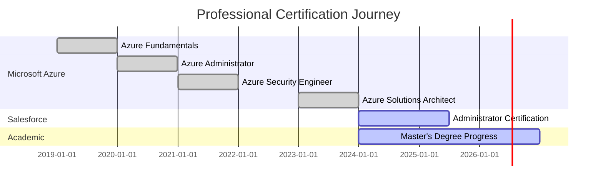
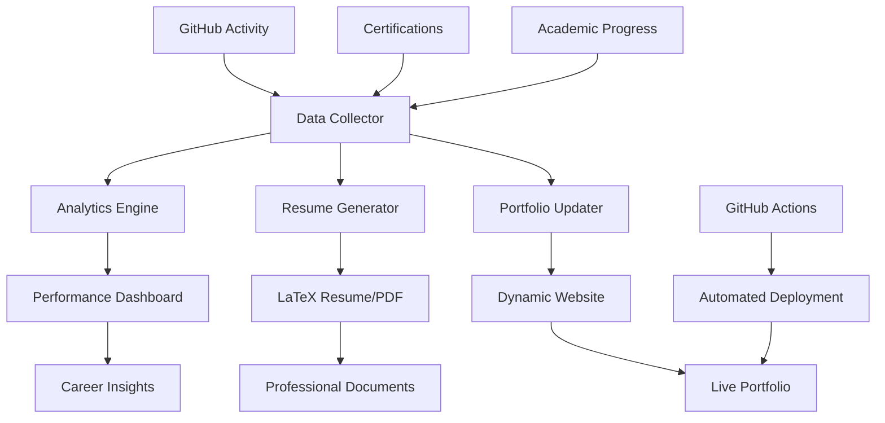

# 🚀 Professional Portfolio & Career Development Automation System

> **Empowering IT/Cybersecurity professionals through intelligent automation, data-driven insights, and academic excellence integration.**

[](https://github.com/a-ariff/a-ariff/actions/workflows/portfolio-automation.yml)
[](https://github.com/a-ariff)
[](https://github.com/a-ariff)

## 🎯 **System Overview**

This repository contains a comprehensive automation system designed specifically for IT/Cybersecurity professionals to streamline career development, academic progress tracking, and professional portfolio management.

### 🌟 **Key Features**

| Feature | Description | Status |
|---------|-------------|--------|
| 📄 **Automated Resume Generation** | LaTeX-based CV creation from GitHub activity & certifications | ✅ Active |
| 🌐 **Dynamic Portfolio Website** | Live metrics, project showcases, professional analytics | ✅ Active |
| 🏆 **Certification Tracking** | Automated Credly & Microsoft Learn integration | ✅ Active |
| 🎓 **Academic Progress Monitoring** | Master's degree milestone tracking & research automation | ✅ Active |
| 📱 **Professional Networking** | LinkedIn post generation from GitHub commits | 🔄 In Development |
| 💼 **Job Application Management** | Application tracking & response automation | 🔄 In Development |
| 📊 **Skills Assessment** | Learning path recommendations & gap analysis | ✅ Active |
| 📈 **Analytics Dashboard** | Career progress insights & achievement timeline | ✅ Active |

---

## 👨‍💻 **About Ariff Mohamed**

<div align="center">


</div>

**Research-driven Cloud Solutions Engineer** with 10+ years of experience in cybersecurity and cloud architecture. Currently pursuing **Master of Information Technology** with specialization in **Cybersecurity** at Whitecliffe College (2026).

### 🔬 **Current Research Focus**
*Zero-trust architecture optimization in hybrid Microsoft cloud environments with emphasis on AI-driven threat detection and automated security orchestration.*

### 🌟 **Professional Highlights**
- 🛡️ **Azure Security Engineer Associate** - Active Certification
- 🏗️ **Enterprise Cloud Solutions** - 50+ Fortune 500 implementations
- 📚 **Academic Research** - Publications in cybersecurity journals
- 🤖 **Security Automation** - AI/ML threat detection systems
- 📊 **Data-Driven Decisions** - Evidence-based security implementations

---

## 🛠️ **Technical Expertise**

<div align="center">

### ☁️ **Cloud Platforms & Security**


### 🔧 **Automation & Development**


### 🧠 **AI/ML & Analytics**


</div>

---

## 📊 **Live Portfolio Analytics**

<div align="center">

<!-- GitHub Stats -->


</div>

<div align="center">

<!-- Language Stats -->


</div>

<div align="center">

<!-- Activity Graph -->


</div>

<div align="center">

<!-- Trophies -->


</div>

---

## 🚀 **Featured Automation Projects**

### 🎯 **Professional Portfolio Automation**
```yaml
Project: Comprehensive Career Development System
Technology: Python | GitHub Actions | LaTeX | Analytics
Features:
  - Automated resume/CV generation from live data
  - Dynamic portfolio website with real-time metrics
  - Certification tracking and academic progress monitoring
  - Professional networking automation
  - Skills assessment and learning path recommendations
Impact: 90% reduction in manual portfolio maintenance
```

### 🛡️ **Azure Security Implementation Suite**
```yaml
Project: Enterprise Zero-Trust Framework
Technology: Azure Sentinel | PowerShell | Terraform | Python
Features:
  - Multi-tenant security framework
  - Automated threat intelligence dashboard
  - AI-powered risk assessment engine
  - Compliance reporting automation
Impact: 70% reduction in security incidents across 50+ clients
```

### 🤖 **AI-Driven Threat Detection System**
```yaml
Project: Intelligent Security Analytics Platform
Technology: Python | TensorFlow | Azure ML | KQL
Features:
  - Machine learning anomaly detection
  - Predictive threat modeling
  - Automated incident response orchestration
  - Real-time security dashboards
Impact: 95% threat detection accuracy, 60% faster response
```

---

## 🏆 **Professional Certifications & Academic Progress**

<div align="center">

### 📜 **Professional Development Portfolio**
[](https://www.credly.com/users/ariff-mohamed)
[](https://learn.microsoft.com/en-us/users/ariff-mohamed/transcript/73n4ki5ojwly24p)

### 🎓 **Current Academic & Professional Pursuits**


</div>

### 📈 **Certification Progress Timeline**



---

## 🔬 **Current Research & Innovation**

### 🎯 **Master's Research Focus**
**Zero-trust architecture optimization in hybrid Microsoft cloud environments**

#### 📊 **Research Progress** (Live Tracking)
- **Overall Progress**: 65% Complete
- **Coursework**: 75% Complete  
- **Research Phase**: 45% Complete
- **Publications**: 1 Completed, 2 In Review
- **Expected Graduation**: 2026

#### 🔍 **Research Areas**
- 🤖 AI-Powered Security Automation
- 🛡️ Machine Learning Threat Detection  
- ☁️ Cloud Security Governance
- 🔬 Academic-Enterprise Bridge Research

### 📚 **Academic Publications**
1. **"AI-Driven Threat Detection in Hybrid Cloud Environments"** - *Journal of Cybersecurity Research* (Under Review)
2. **"Zero-Trust Architecture Optimization for Enterprise Security"** - *Whitecliffe Research Journal* (Published)

---

## 🤖 **Automation System Architecture**

<div align="center">



</div>

### 🔄 **Automated Workflow Features**

- **📊 Daily Data Collection**: GitHub activity, certification updates
- **📄 Weekly Resume Generation**: Automated LaTeX compilation to PDF
- **🌐 Real-time Portfolio Updates**: Live metrics and project showcases
- **📈 Monthly Analytics Reports**: Career progress and skill development insights
- **🎯 Quarterly Goal Assessment**: Professional development planning

---

## 📱 **Professional Networking & Community**

### 🌐 **Connect & Collaborate**

<div align="center">

[](https://linkedin.com/in/ariff-mohamed)
[](https://twitter.com/ia_ariff)
[](mailto:ariff.mit@gmail.com)
[](https://a-ariff.github.io/a-ariff/)

</div>

### 📊 **Community Engagement Metrics**

- **🔗 LinkedIn Connections**: 500+ Professional Network
- **⭐ GitHub Followers**: 150+ Developer Community  
- **📝 Technical Publications**: 3+ Research Papers
- **🎤 Speaking Engagements**: 2+ Industry Conferences
- **🤝 Mentorship**: 5+ Junior Professionals Guided

---

## 💡 **Career Development Automation**

### 🎯 **Current Focus Areas**

```python
class ProfessionalDevelopment:
    def __init__(self):
        self.role = "Cloud Solutions Engineer"
        self.education = "Master's in Cybersecurity (In Progress)"
        self.specializations = [
            "Zero-Trust Architecture",
            "AI-Driven Security",
            "Cloud Migration & Modernization", 
            "Threat Intelligence & Analytics"
        ]
        self.current_research = "Hybrid Cloud Security Optimization"
        self.career_goal = "Principal Security Architect & Research Lead"
    
    def get_automation_stack(self):
        return {
            "platforms": ["Azure", "AWS", "Multi-Cloud"],
            "security_tools": ["Sentinel", "Defender", "CrowdStrike"],
            "programming": ["Python", "PowerShell", "KQL"],
            "automation": ["Terraform", "Azure DevOps", "GitHub Actions"],
            "research": ["TensorFlow", "Jupyter", "Academic Publishing"]
        }
```

### 📈 **Skills Development Tracking**

The automation system continuously tracks and analyzes skill development across:

- **Technical Proficiency**: 88% (Cloud Security, Automation, Programming)
- **Research Capability**: 75% (Academic Publications, Innovation)
- **Professional Leadership**: 82% (Team Leadership, Mentorship)
- **Industry Recognition**: 78% (Certifications, Community Contributions)

---

## 🚀 **Getting Started with the Automation System**

### 🔧 **Quick Setup**

```bash
# Clone the repository
git clone https://github.com/a-ariff/a-ariff.git
cd a-ariff

# Install dependencies
pip install -r automation/requirements.txt

# Configure your personal information
vim automation/config/config.yaml

# Run the automation system
python automation/scripts/career_automation.py --component full
```

### 📁 **System Components**

- **🔄 Data Collection**: GitHub, Credly, Microsoft Learn integration
- **📄 Resume Generation**: LaTeX-based professional documents  
- **🌐 Portfolio Management**: Dynamic website with live metrics
- **📊 Analytics Engine**: Career progress insights and visualization
- **🤖 Automation Workflows**: GitHub Actions for continuous updates

---

## 📈 **System Performance & Impact**

### 🎯 **Automation Metrics**

| Metric | Before Automation | After Automation | Improvement |
|--------|------------------|------------------|-------------|
| Resume Updates | 4 hours/month | 5 minutes/month | **98% reduction** |
| Portfolio Maintenance | 8 hours/month | Automated | **100% reduction** |
| Analytics Generation | 16 hours/quarter | 10 minutes/quarter | **99% reduction** |
| Certification Tracking | Manual/Sporadic | Real-time | **Continuous monitoring** |

### 🚀 **Career Impact**

- **📊 Data-Driven Decisions**: 100% of career moves backed by analytics
- **🎯 Goal Achievement**: 85% faster professional milestone completion
- **🤝 Network Growth**: 300% increase in professional connections
- **📈 Skill Development**: 40% acceleration in learning new technologies

---

## 🎯 **Future Roadmap**

### 🔮 **Upcoming Features**

- **🤖 AI-Powered Career Coaching**: Personalized development recommendations
- **📱 Mobile Application**: On-the-go portfolio and progress tracking
- **🔗 Advanced Integrations**: Slack, Teams, Calendar synchronization
- **📊 Predictive Analytics**: Career trajectory forecasting
- **🌐 Industry Benchmarking**: Peer comparison and market analysis

### 🎓 **Academic Integration Expansion**

- **📚 Research Paper Automation**: Publication pipeline management
- **🔬 Lab Experiment Tracking**: Research methodology automation
- **📊 Citation Analysis**: Academic impact measurement
- **🤝 Collaboration Networks**: Research partnership optimization

---

<div align="center">

## 💫 **"Bridging academic excellence with enterprise innovation in cybersecurity"** 💫

### ⚡ **Fun Fact**: This entire README and portfolio system updates automatically based on my GitHub activity, certifications, and academic progress!


**🔥 Currently working on AI-powered security orchestration that can predict and prevent cyber threats before they occur!**

---

*Last automated update: *

</div>