# 💫 Hi there! I'm **Ariff Mohamed** 

  
  
  
  
  
  

---

## 🎯 **About Me**

> 🔬 **Research-Driven Cloud Solutions Engineer** | 🎓 **MIT Student (Cybersecurity Focus)** | ☁️ **Azure Security Engineer Associate**

I'm pursuing my **Master of Information Technology** with specialization in **Cybersecurity** (2026) at Whitecliffe College, where I bridge academic research with enterprise practice to deliver cutting-edge security solutions.

### 🌟 **What I Bring to the Table:**
- 🔒 **Evidence-Based Security** – Applying research methodologies to cybersecurity implementations
- 🛡️ **Advanced Threat Intelligence** – Academic-backed approach to Azure Sentinel and Defender deployments  
- 🤖 **Intelligent Security Systems** – Integrating AI/ML research with Microsoft security stack
- 📊 **Strategic Technology Management** – Academic governance frameworks applied to enterprise environments

### 🔬 **Current Research Focus:**
*Zero-trust architecture optimization in hybrid Microsoft cloud environments*

 

---

## 🛠️ **Tech Stack & Expertise**

### ☁️ **Cloud & Infrastructure**

### 🔐 **Security & Compliance**

### 🚀 **DevOps & Automation**

---

## 📊 **GitHub Analytics**

  
  
  

---

## 🏆 **Achievements & Certifications**

### 🎯 **Professional Achievements:**
- 🥇 **Azure Security Engineer Associate** - Microsoft Certified
- 🎓 **MIT Cybersecurity Specialization** - In Progress (2026)
- 🔬 **Published Research** - Zero-trust architecture optimization
- 💼 **Enterprise Implementations** - Large-scale cloud security deployments

---

## 🚀 **Featured Projects**

### 💼 **Professional Portfolio**

<table align="center">
<tr>
<td width="50%">

### 🔧 [Intune Remediation Scripts](https://github.com/a-ariff/intune-remediation-scripts)
**Microsoft Intune remediation scripts and configurations**
- 🛡️ Automated compliance enforcement
- 🔄 Proactive device remediation
- 📊 Advanced reporting and analytics
- ⚡ Zero-touch deployment solutions

</td>
<td width="50%">

### ☁️ [Azure Security Baselines](https://github.com/a-ariff)
**Enterprise-grade security configuration templates**
- 🔒 Zero-trust architecture implementation
- 🛡️ Advanced threat protection
- 📋 Compliance automation frameworks
- 🚀 Infrastructure as Code templates

</td>
</tr>
</table>

---

## 📈 **What I'm Currently Working On**

```mermaid
graph TD
    A[🔬 Research Projects] --> B[Zero-Trust Architecture]
    A --> C[AI/ML Security Integration]
    D[💼 Professional Work] --> E[Enterprise Cloud Migration]
    D --> F[Security Compliance Automation]
    G[🎓 Academic Studies] --> H[MIT Cybersecurity Program]
    G --> I[Research Publications]
```

### 🎯 **Current Focus Areas:**
- 🔬 **Research:** Zero-trust architecture optimization in hybrid cloud environments
- 💼 **Professional:** Large-scale Azure security implementations for enterprise clients
- 🎓 **Academic:** Advanced cybersecurity coursework and research methodology
- 🚀 **Innovation:** AI-powered security automation and threat intelligence systems

---

## 🌐 **Let's Connect!**

### 💬 **Open to:**
🤝 **Collaboration** • 🎯 **Research Partnerships** • 💼 **Professional Opportunities** • 🎓 **Academic Discussions**

---

*"Bridging academic excellence with enterprise innovation to build tomorrow's secure cloud infrastructure."*

---

  
  **🌟 Thanks for visiting my profile! Don't forget to ⭐ star repositories you find interesting!**
  
  
  

