<div align="center">

# 💫 Hi there! I'm **Ariff Mohamed** 🚀


[](https://github.com/a-ariff)
[](https://github.com/a-ariff)
[](https://linkedin.com/in/ariff-mohamed)

</div>

---

---

## 📋 Navigation
- [About Me](#-about-me)
- [Tech Stack & Expertise](#️-tech-stack--expertise)
- [Certifications & Achievements](#-certifications--achievements)
- [Featured Projects](#-featured-projects)
- [GitHub Statistics](#-github-statistics)
- [What I'm Currently Working On](#-what-im-currently-working-on)
- [Let's Connect & Collaborate](#-lets-connect--collaborate)

---


## 🎯 **About Me**

> **Research-Driven Cloud Solutions Engineer** | **MIT Student (Cybersecurity Focus)** | **Azure Security Engineer Associate**

I'm pursuing my **Master of Information Technology** with specialization in **Cybersecurity** (2026) at Whitecliffe College, where I bridge academic research with enterprise practice to deliver cutting-edge cloud solutions.

### 🌟 **What I Bring to the Table:**
- 🔒 **Evidence-Based Security** – Applying research methodologies to cybersecurity implementations
- 🛡️ **Advanced Threat Intelligence** – Academic-backed approach to Azure Sentinel and Defender deployments
- 🤖 **Intelligent Security Systems** – Integrating AI/ML research with Microsoft security stack
- 📊 **Strategic Technology Management** – Academic governance frameworks applied to enterprise environments
- 🏗️ **Enterprise Architecture** – Designing scalable, secure cloud solutions for Fortune 500 companies

### 🔬 **Current Research Focus:**
*Zero-trust architecture optimization in hybrid Microsoft cloud environments with emphasis on AI-driven threat detection*

<br clear="right"/>

---

## 🛠️ **Tech Stack & Expertise**

<div align="center">

### ☁️ **Cloud & Infrastructure**


### 🔐 **Security & Compliance**


### 💻 **Development & Analytics**


### 📊 **Data & AI/ML**


</div>

---

## 🏆 **Certifications & Achievements**

<div align="center">

### 📜 **Microsoft Certifications**
[](https://learn.microsoft.com/en-us/users/ariff-mohamed/transcript/73n4ki5ojwly24p)
[](https://learn.microsoft.com/api/credentials/share/en-us/Ariff-Mohamed/1DE42D8D3E20360F?8ac53fd9)
[](https://learn.microsoft.com/api/credentials/share/en-us/Ariff-Mohamed/27EA011B0DB995A?8ac53fd9)
[](https://learn.microsoft.com/api/credentials/share/en-us/Ariff-A/1FF2E73BDCAE576?sharingId=5996650C026DFF6A)
[](https://learn.microsoft.com/api/credentials/share/en-us/Ariff-Mohamed/5E7B5535D853075?8ac53fd9)
[](https://learn.microsoft.com/api/credentials/share/en-us/Ariff-Mohamed/FFE73C769C6190B1?8ac53fd9)
[](https://learn.microsoft.com/api/credentials/share/en-us/Ariff-Mohamed/7CA3C54A4DAAF6D?8ac53fd9)

### 📜 **AvePoint Certifications**
[](https://www.credly.com/users/ariff-mohamed)
[](https://www.credly.com/badges/41165314/public_url)
[](https://www.credly.com/badges/9b33d9ab/public_url)
[](https://www.credly.com/badges/47bfa023/public_url)
[](https://www.credly.com/badges/c526d426/public_url)

### 🎓 **Academic**


</div>

---

## 🚀 **Featured Projects**

### 🛡️ **Azure Security Implementation Suite**
```yaml
Project: Enterprise Zero-Trust Framework
Technology: Azure Sentinel | Defender | PowerShell | Terraform
Impact: 40% reduction in security incidents across 50+ enterprise clients
Features:
  - Multi-tenant Security Framework
  - Real-time Threat Intelligence Dashboard  
  - Automated Compliance Reporting
  - AI-powered Risk Assessment
```

### 🤖 **AI-Powered Threat Detection System**
```yaml
Project: Intelligent Security Analytics Platform
Technology: Python | TensorFlow | Azure ML | Power BI
Impact: 95% accuracy in threat prediction, 60% faster incident response
Features:
  - Machine Learning Anomaly Detection
  - Predictive Threat Modeling
  - Automated Response Orchestration
  - Real-time Security Dashboards
```

### 🏗️ **Cloud Migration & Modernization**
```yaml
Project: Fortune 500 Cloud Transformation
Technology: Azure | Kubernetes | Terraform | DevOps
Impact: $2M+ cost savings, 99.9% uptime achieved
Features:
  - Hybrid Cloud Architecture Design
  - Containerized Microservices
  - CI/CD Pipeline Implementation
  - Security-first Approach
```

### 📂 **GitHub Repository Links**

[](https://github.com/a-ariff/intune-remediation-scripts)
[](https://github.com/a-ariff/azure-landing-zone-bicep)
[](https://github.com/a-ariff/OutlookPolicyKit)
[](https://github.com/a-ariff/network-automation-mdm)
[](https://github.com/a-ariff/browser-popup-mdm-automation)
[](https://github.com/a-ariff/sentinel-content-library)

---

## 📈 **GitHub Statistics**

<div align="center">


</div>

<div align="center">

[](https://git.io/streak-stats)

</div>

<div align="center">


</div>

---

## 📈 **What I'm Currently Working On**

```mermaid
graph TD
    A[🔬 Research Projects] --> B[Zero-Trust Architecture]
    A --> C[AI/ML Security Integration]
    D[💼 Professional Work] --> E[Enterprise Cloud Migration]
    D --> F[Security Compliance Automation]
    G[🎓 Academic Studies] --> H[MIT Cybersecurity Program]
    G --> I[Research Publications]
```

<div align="center">



</div>

### 🎯 **Current Focus Areas:**
- 🔬 **Research:** Zero-trust architecture optimization in hybrid cloud environments
- 💼 **Professional:** Large-scale Azure security implementations for enterprise clients
- 🎓 **Academic:** Advanced cybersecurity coursework and research methodology
- 🚀 **Innovation:** AI-powered security automation and threat intelligence systems
- 🛠️ **Development:** PowerShell and Bicep automation modules for Azure, Sentinel, and device management

---

## 🌐 **Let's Connect & Collaborate**

<div align="center">

[](https://linkedin.com/in/ariff-mohamed)
[](mailto:contact@aglobaltec.com)
[](https://portfolio.aglobaltec.com/)
[](https://github.com/a-ariff)

</div>

---

<div align="center">

### 💫 *"Bridging academic excellence with enterprise innovation in cybersecurity"* 💫


**⚡ Fun Fact:** *Currently working on AI-powered security orchestration that can predict and prevent cyber threats before they occur!*

</div>

---

<!-- Snake Game Animation -->
<div align="center">
  
  
</div>
