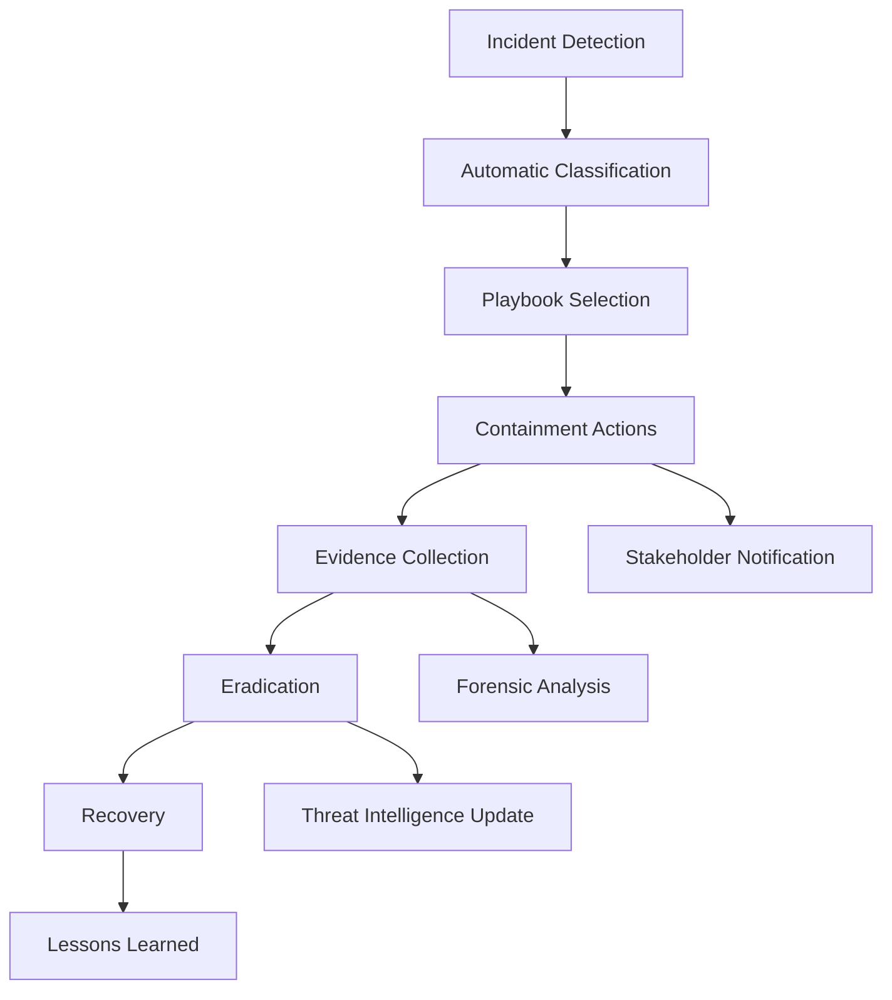

# 🚨 Security Incident Response Playbooks

This directory contains automated incident response playbooks and procedures for the Advanced Cybersecurity Automation Framework.

## 📋 Available Playbooks

### 1. **Data Breach Response**
- **File**: `data-breach-response.yml`
- **Triggers**: Unauthorized data access, data exfiltration alerts
- **Automation Level**: High
- **MTTR Target**: 30 minutes

### 2. **Malware Incident Response**
- **File**: `malware-incident-response.yml`
- **Triggers**: Malware detection, suspicious file execution
- **Automation Level**: Medium
- **MTTR Target**: 15 minutes

### 3. **Phishing Attack Response**
- **File**: `phishing-attack-response.yml`
- **Triggers**: Phishing email detection, user reports
- **Automation Level**: High
- **MTTR Target**: 10 minutes

### 4. **Insider Threat Response**
- **File**: `insider-threat-response.yml`
- **Triggers**: Anomalous user behavior, privilege escalation
- **Automation Level**: Medium
- **MTTR Target**: 45 minutes

### 5. **DDoS Attack Response**
- **File**: `ddos-attack-response.yml`
- **Triggers**: Traffic anomalies, service degradation
- **Automation Level**: High
- **MTTR Target**: 5 minutes

### 6. **Zero-Day Exploit Response**
- **File**: `zero-day-exploit-response.yml`
- **Triggers**: Unknown vulnerability exploitation
- **Automation Level**: Low (requires human expertise)
- **MTTR Target**: 60 minutes

## 🔄 Automation Workflow



## 📊 Incident Classification Matrix

| Severity | Impact | Response Time | Escalation Level |
|----------|---------|---------------|------------------|
| **Critical** | Business Operations Stopped | 15 minutes | C-Level + External |
| **High** | Significant Service Impact | 30 minutes | Senior Management |
| **Medium** | Limited Service Impact | 60 minutes | IT Security Team |
| **Low** | Minimal/No Impact | 4 hours | Security Analyst |

## 🛠️ Integration Points

### Microsoft Defender
- Automated threat containment
- Evidence collection
- Threat intelligence enrichment

### Azure Sentinel
- SOAR (Security Orchestration, Automation & Response)
- Custom playbooks execution
- Multi-source correlation

### Third-Party Tools
- SIEM integration
- Ticketing systems (ServiceNow, Jira)
- Communication platforms (Teams, Slack)

## 📞 Emergency Contacts

```yaml
contacts:
  security_team:
    primary: "security-team@company.com"
    phone: "+1-xxx-xxx-xxxx"
  
  incident_commander:
    primary: "incident-commander@company.com"
    phone: "+1-xxx-xxx-xxxx"
  
  legal_team:
    primary: "legal@company.com"
    phone: "+1-xxx-xxx-xxxx"
  
  public_relations:
    primary: "pr@company.com"
    phone: "+1-xxx-xxx-xxxx"
```

## 🔧 Playbook Execution

### Manual Execution
```bash
# Execute specific playbook
./execute-playbook.sh --playbook malware-incident-response --severity high

# Test playbook
./test-playbook.sh --playbook data-breach-response --dry-run
```

### Automated Execution
Playbooks are automatically triggered by:
- SIEM alerts
- Sentinel detection rules
- Defender threat alerts
- Custom monitoring rules

## 📝 Documentation Standards

Each playbook includes:
- **Scope**: What incidents it covers
- **Prerequisites**: Required tools and access
- **Steps**: Detailed response procedures
- **Automation**: Which steps are automated
- **Escalation**: When and how to escalate
- **Recovery**: System restoration procedures
- **Post-Incident**: Review and improvement actions

## 🎓 Training & Drills

### Quarterly Drills
- Tabletop exercises
- Simulated incident response
- Playbook effectiveness testing
- Team coordination practice

### Annual Review
- Playbook updates
- Process improvements
- Tool integration updates
- Compliance alignment

## 📈 Metrics & KPIs

- **Mean Time to Detection (MTTD)**: Target < 15 minutes
- **Mean Time to Containment (MTTC)**: Target < 30 minutes
- **Mean Time to Recovery (MTTR)**: Target < 2 hours
- **False Positive Rate**: Target < 5%
- **Automation Rate**: Target > 80%

## 🔍 Continuous Improvement

### Feedback Loop
1. Incident occurs
2. Playbook executed
3. Results analyzed
4. Lessons learned documented
5. Playbook updated
6. Team trained on changes

### Regular Updates
- Monthly playbook reviews
- Quarterly threat landscape updates
- Annual framework overhaul
- Continuous tool integration improvements

---

*Advanced Cybersecurity Automation Framework | Research-Grade Incident Response*